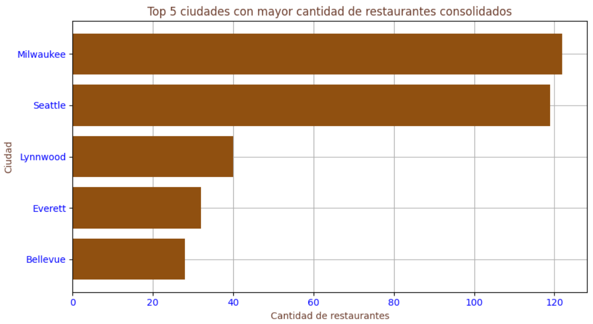
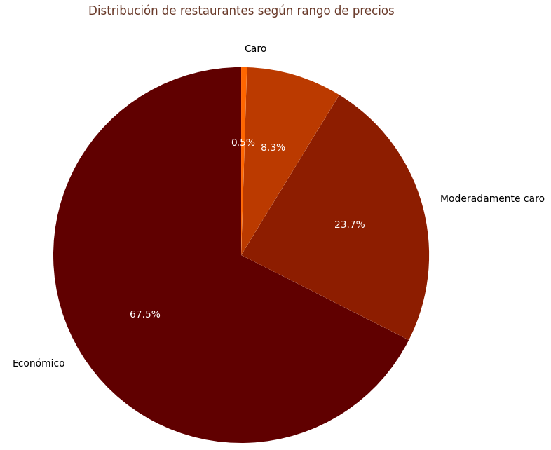
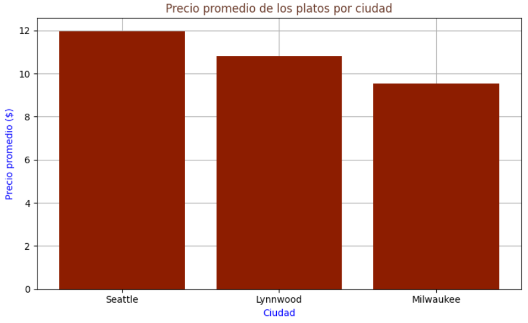
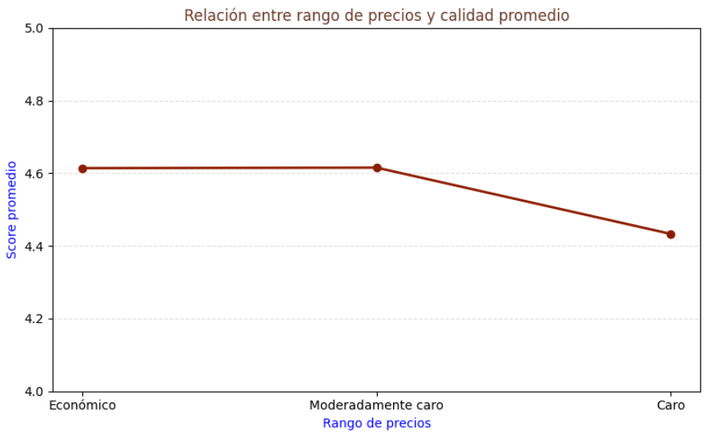

# 

# Trabajo Práctico Integrador: Pipeline ETL & Inteligencia de Mercado (Food Delivery)

## Contexto de negocio
---
He sido contratada como Data Engineer y Analista BI por el CEO de una startup de Food Delivery que busca expandirse en Estados Unidos. Mi objetivo es analizar a los competidores, las categorías de mercado y los precios por región para apoyar la toma de decisiones. Para ello, desarrollaré un pipeline ETL que incluya la limpieza, transformación y optimización de los datos, su carga en SQLite y el desarrollo de consultas y visualizaciones que faciliten el análisis de los resultados.

## Base de datos
---
Los datos originales se pueden encontrar [aquí](https://github.com/IanCN-23/dalatam_ed3_TPI_Python/tree/main).

Primero descargué y descomprimí el archivo ZIP que contenía los datasets. Luego, creé la carpeta **Bances-proyecto-etl-delivery.** como espacio de trabajo y añadí los archivos `restaurant-menus.csv` y `restaurants.csv`, que serán utilizados para desarrollar el proceso ETL.

## Librerías utilizadas
---
Para el análisis y procesamiento de los datos se utilizaron las siguientes librerías:

```python
import pandas as pd
import numpy as np
import matplotlib.pyplot as plt
import seaborn as sns

from sqlalchemy import create_engine, text
```

**Descripción:**
- `pandas`: trabajar con los datos.
- `numpy`: operaciones numéricas.
- `matplotlib` y `seaborn`: gráficos.
- `sqlalchemy`: conexión y carga de datos a SQLite.

### Parte 1 - Extracción y Diagnóstico (Extract)

#### 1.1  Cargar los archivos CSV en DataFrames:

Archivo de restaurante

```python
import pandas as pd

# Identifico la ruta del archivo de restaurantes
url_restaurante = "/Workspace/Users/bances27caro@gmail.com/CURSO_PHYTON/Bances-proyecto-etl-delivery./restaurants.csv/restaurants.csv"

# Cargo el archivo
df_restaurantes = pd.read_csv(url_restaurante)

# Visualizo las primeras filas
display(df_restaurantes.head())
```

| id | position | name | score | ratings | category | price_range | full_address | zip_code | lat | lng |
|---:|---:|---|---:|---:|---|:---:|---|---:|---:|---:|
| 1 | 19 | PJ Fresh (224 Daniel Payne Drive) | null | null | Burgers, American, Sandwiches | $ | 224 Daniel Payne Drive, Birmingham, AL, 35207 | 35207 | 33.5623653 | -86.8307025 |
| 2 | 9 | J' ti`'z Smoothie-N-Coffee Bar | null | null | Coffee and Tea, Breakfast and Brunch, Bubble Tea | null | 1521 Pinson Valley Parkway, Birmingham, AL, 35217 | 35217 | 33.58364 | -86.77333 |
| 3 | 6 | Philly Fresh Cheesesteaks (541-B Graymont Ave) | null | null | American, Cheesesteak, Sandwiches, Alcohol | $ | 541-B Graymont Ave, Birmingham, AL, 35204 | 35204 | 33.5098 | -86.85464 |
| 4 | 17 | Papa Murphy's (1580 Montgomery Highway) | null | null | Pizza | $ | 1580 Montgomery Highway, Hoover, AL, 35226 | 35226 | 33.4044388 | -86.8066142 |
| 5 | 162 | Nelson Brothers Cafe (17th St N) | 4.7 | 22 | Breakfast and Brunch, Burgers, Sandwiches | null | 314 17th St N, Birmingham, AL, 35203 | 35203 | 33.51473 | -86.8117 |

Archivo de menús, aquí se debe unir las 10 partes.

```python
import pandas as pd

# Ruta de la carpeta donde están las partes de los menús
ruta_menus = "/Workspace/Users/bances27caro@gmail.com/CURSO_PHYTON/Bances-proyecto-etl-delivery./restaurant-menus.csv"

# Lista con los nombres de los 10 archivos
archivos_menus = [
    f"restaurant_menus_parte_{i}.csv"
    for i in range(1, 11)
]

# Leer cada archivo y guadarlo en una lista
lista_menus = []

for archivo in archivos_menus:
    ruta = f"{ruta_menus}/{archivo}"
    df_parte = pd.read_csv(ruta)
    lista_menus.append(df_parte)

# Unir todas las partes
df_menus = pd.concat(lista_menus, ignore_index=True)

# Mostrar las primeras filas
display(df_menus.head())
```

| restaurant_id | category | name | description | price |
|---:|---|---|---|---:|
| 1 | Extra Large Pizza | Extra Large Meat Lovers | Whole pie. | 15.99 USD |
| 1 | Extra Large Pizza | Extra Large Supreme | Whole pie. | 15.99 USD |
| 1 | Extra Large Pizza | Extra Large Pepperoni | Whole pie. | 14.99 USD |
| 1 | Extra Large Pizza | Extra Large BBQ Chicken &amp; Bacon | Whole Pie | 15.99 USD |
| 1 | Extra Large Pizza | Extra Large 5 Cheese | Whole pie. | 14.99 USD |

#### 1.2 Análisis exploratorio (Data Profiling):

Primero, se busca conocer las dimensiones:

```python
# Dimensiones del DataFrame de restaurantes
print(f"df_restaurantes: contiene {df_restaurantes.shape[0]} filas y {df_restaurantes.shape[1]} columnas")

# Dimensiones del DataFrame de menús
print(f"df_menus: contiene {df_menus.shape[0]} filas y {df_menus.shape[1]} columnas")
```

**Resultado**:
```
df_restaurantes: contiene 63469 filas y 11 columnas

df_menus: contiene 836350 filas y 5 columnas
```
Ahora identifico los tipos de datos y la cantidad de valores nulos por columna.

```python
# Perfil de datos de restaurantes
perfil_restaurantes = pd.DataFrame({
    "Categoria": df_restaurantes.columns,
    "Tipo de dato": df_restaurantes.dtypes.astype(str).values,
    "Valores nulos": df_restaurantes.isna().sum().values
})
display(perfil_restaurantes)
```

| Categoria | Tipo de dato | Valores nulos |
|---|---|---:|
| id | int64 | 0 |
| position | int64 | 0 |
| name | object | 0 |
| score | float64 | 28167 |
| ratings | float64 | 28167 |
| category | object | 85 |
| price_range | object | 10617 |
| full_address | object | 453 |
| zip_code | object | 517 |
| lat | float64 | 0 |
| lng | float64 | 0 |

```python
# Perfil de datos de menús
perfil_menus = pd.DataFrame({
    "Categoria": df_menus.columns,
    "Tipo de dato": df_menus.dtypes.astype(str).values,
    "Valores nulos": df_menus.isna().sum().values
})
display(perfil_menus)
```

| Categoria | Tipo de dato | Valores nulos |
|---|---|---:|
| restaurant_id | int64 | 0 |
| category | object | 0 |
| name | object | 1 |
| description | object | 200324 |
| price | object | 0 |

### Parte 2 - Ingeniería de Características y Limpieza (Transform)

#### _En df_restaurantes:_

#### 2.1  Mapeo de Precios:

En el DataFrame df_restaurantes, la columna price_range contiene símbolos como $ que representan diferentes rangos de precios. Para facilitar su interpretación y análisis, se creó un diccionario que permite reemplazar cada símbolo por una categoría de precio expresada mediante nombres descriptivos.

```python
mapeo_precios = {
    "$": "Económico",
    "$$": "Moderadamente caro",
    "$$$": "Caro",
    "$$$$": "Muy caro"
}

# Se determina la cantidad de símbolos
df_restaurantes["rango_de_precios"] = df_restaurantes["price_range"].map(mapeo_precios)
df_restaurantes["rango_de_precios"].value_counts()
```

**Resultado**
```
rango_de_precios
Económico             37637
Moderadamente caro    14952
Caro                    237
Muy caro                 25
Name: count, dtype: int64
```
#### 2.2  Desanidado de Ubicaciones:

En este punto separo la información que está junta en la columna `full_address`.

| full_address |
|---|
| 224 Daniel Payne Drive, Birmingham, AL, 35207 |
| 1521 Pinson Valley Parkway, Birmingham, AL, 35217 |
| 541-B Graymont Ave, Birmingham, AL, 35204 |
| 1580 Montgomery Highway, Hoover, AL, 35226 |
| 314 17th St N, Birmingham, AL, 35203 |

```python
# Se utiliza .str.split() para dividir la columna "full_address" en tres columnas.
df_restaurantes[["calle", "ciudad", "estado_zip"]] = (
    df_restaurantes["full_address"].str.split(",", n=2, expand=True)
)

# Se elimina los espacios que puedan quedar antes o después del nombre de la ciudad.
df_restaurantes["ciudad"] = df_restaurantes["ciudad"].str.strip()

display(df_restaurantes[["calle", "ciudad", "estado_zip"]].head())
```

**Resultado**
| calle | ciudad | estado_zip |
|---|---|---|
| 224 Daniel Payne Drive | Birmingham | AL, 35207 |
| 1521 Pinson Valley Parkway | Birmingham | AL, 35217 |
| 541-B Graymont Ave | Birmingham | AL, 35204 |
| 1580 Montgomery Highway | Hoover | AL, 35226 |
| 314 17th St N | Birmingham | AL, 35203 |

#### 2.3 Filtro de Calidad:

En este apartado, se eliminan los restaurantes que no cuenten con un puntaje registrado o cuyo puntaje sea igual a 0. Asimismo, se estandariza la columna category convirtiendo todos sus valores a minúsculas, con el objetivo de mantener un formato uniforme en los datos.

```python
# Se elimina los score nulos
df_restaurantes = df_restaurantes[df_restaurantes["score"].notna()]

# Se elimina los score iguales a 0
df_restaurantes = df_restaurantes[df_restaurantes["score"] != 0]

# Se estandariza category
df_restaurantes["category"] = (df_restaurantes["category"].str.lower())

display(df_restaurantes[["score", "category"]].head(10))
```
| score | category |
|---:|---|
| 4.7 | breakfast and brunch, burgers, sandwiches |
| 4.7 | sushi, asian, japanese |
| 4.6 | breakfast and brunch, salad, sandwich, family meals, pizza, healthy, american, chicken |
| 5 | ice cream &amp; frozen yogurt, comfort food, desserts |
| 4.9 | middle eastern, mediterranean, vegetarian, greek, healthy |
| 3.7 | american, burgers, sandwich |
| 4.7 | italian, exclusive to eats |
| 4.6 | bakery, breakfast and brunch, cafe, coffee &amp; tea |
| 4.8 | mexican, fast food, salads, healthy |
| 4.3 | mexican, breakfast and brunch, burritos |

Para comprobar que ya no quedan score nulos ni ceros:

```python
print("Valores nulos en score:", df_restaurantes["score"].isna().sum())
print("Scores iguales a 0:", (df_restaurantes["score"] == 0).sum())
```

**Resultado**
```python
Valores nulos en score: 0
Scores iguales a 0: 0
```

#### _En df_menus:_

#### 2.4 Limpieza de precios:

Se transformz la columna `price`, que actualmente contiene los precios como texto. Primero se elimina el texto " USD", luego se reemplaza la coma decimal por un punto y finalmente se convierte el resultado a formato `float`. Esto permite trabajar posteriormente con los precios como valores numéricos.

```python
# Se elimina los ítems del menú que no tienen precio registrado
df_menus = df_menus[df_menus["price"].notna()]

# Se elimina el texto " USD"
df_menus["price"] = df_menus["price"].astype(str).str.replace(" USD", "", regex=False)

# Se reemplaza la coma decimal por un punto
df_menus["price"] = df_menus["price"].str.replace(",", ".", regex=False)

# Convertir la columna a formato decimal
df_menus["price"] = df_menus["price"].astype(float)

# Se visualiza el resultado de la transformación
display(df_menus[["price"]].head(10))
```

| price |
|---:|
| 15.99 |
| 15.99 |
| 14.99 |
| 15.99 |
| 14.99 |
| 3.99 |
| 3.99 |
| 3.99 |
| 3.99 |
| 3.99 |

#### 2.5 Eliminación de precios nulos o iguales a 0.0

Se eliminan los ítems del menú que no tengan un precio registrado o cuyo precio sea igual a `0.0`. De esta manera, el DataFrame conserva únicamente los registros que tengan un precio válido para el análisis.

```python
# Para comprobar los precios nulos y los que tienen valor 0
print("Precios nulos:", df_menus["price"].isna().sum())
print("Precios iguales a 0:", (df_menus["price"] == 0).sum())
```

**Resultado**
```
Precios nulos: 0
Precios iguales a 0: 37551
```

```python
# Se elimina los precios nulos
df_menus = df_menus[df_menus["price"].notna()]

# Se elimina los precios iguales a 0
df_menus = df_menus[df_menus["price"] != 0]

# Visualizar los datos después de la limpieza
display(df_menus[["price"]].head(10))
```

| price |
|---:|
| 15.99 |
| 15.99 |
| 14.99 |
| 15.99 |
| 14.99 |
| 3.99 |
| 3.99 |
| 3.99 |
| 3.99 |
| 3.99 |

Para comprobar que la eliminación se realizó correctamente:

```python
print("Precios nulos:", df_menus["price"].isna().sum())
print("Precios iguales a 0:", (df_menus["price"] == 0).sum())
```

**Resultado**
```
Precios nulos: 0
Precios iguales a 0: 0
```

## Optimización y Cruce (Control de Memoria RAM):
---

En este apartado se reduce el tamaño de `df_restaurantes` antes de realizar el cruce con `df_menus`. Esto permite trabajar únicamente con restaurantes consolidados, evitando procesar información innecesaria y ayudando a controlar el consumo de memoria RAM.

```python
# Se visusliza la columna de calificaciones
display(df_restaurantes[["ratings"]].head(10))

# Filtrar los restaurantes que tienen más de 100 calificaciones
df_restaurantes = df_restaurantes[df_restaurantes["ratings"] > 100]

# Se visusliza el resultado del filtro
display(df_restaurantes[["ratings"]].head(10))
```

Para comprobar que el filtro se realizó correctamente:

```python
print("Cantidad de restaurantes después del filtro:", len(df_restaurantes))
print("Cantidad mínima de ratings:",df_restaurantes["ratings"].min())
```

**Resultado**
```
Cantidad de restaurantes después del filtro: 8702
Cantidad mínima de ratings: 101.0
```

Una vez filtrados los restaurantes, realizo un INNER JOIN entre `df_restaurantes` y `df_menus`. El cruce permite combinar la información de los restaurantes con sus respectivos productos del menú.

Para realizarlo necesito utilizar la columna que contiene el ID del restaurante en ambos DataFrames.

```python
# Realizar el INNER JOIN mediante el ID del restaurante
df_master = pd.merge(
    df_restaurantes,
    df_menus,
    left_on="id",
    right_on="restaurant_id",
    how="inner"
)
# Visualizar el DataFrame resultante
display(df_master.head())
```
| id | position | name_x | score | ratings | category_x | price_range | full_address | zip_code | lat | lng | rango_de_precios | calle | ciudad | estado_zip | restaurant_id | category_y | name_y | description | price |
|---:|---:|---|---:|---:|---|:---:|---|---:|---:|---:|---|---|---|---|---:|---|---|---|---:|
| 1739 | 21 | Pho Cali Noodle House | 4.4 | 200 | vietnamese, noodles, sandwich, asian | $ | 4756 S 27th St, Milwaukee, WI, 53221 | 53221 | 42.958143 | -87.94815 | Económico | 4756 S 27th St | Milwaukee | WI, 53221 | 1739 | Picked for you | Spring Roll | Three rolls. Shrimps, sliced pork, vermicelli noodles, lettuce are wrapped in steamed rice paper. Served with peanut dipping sauce. | 6.99 |
| 1739 | 21 | Pho Cali Noodle House | 4.4 | 200 | vietnamese, noodles, sandwich, asian | $ | 4756 S 27th St, Milwaukee, WI, 53221 | 53221 | 42.958143 | -87.94815 | Económico | 4756 S 27th St | Milwaukee | WI, 53221 | 1739 | Picked for you | Egg Roll | Pork, carrot, bean thread noodles, and are wrapped in rice paper. Served deep fried egg roll with mixed fish sauce. | 6.5 |
| 1739 | 21 | Pho Cali Noodle House | 4.4 | 200 | vietnamese, noodles, sandwich, asian | $ | 4756 S 27th St, Milwaukee, WI, 53221 | 53221 | 42.958143 | -87.94815 | Económico | 4756 S 27th St | Milwaukee | WI, 53221 | 1739 | Picked for you | Grilled Pork | Foot long. | 9.5 |
| 1739 | 21 | Pho Cali Noodle House | 4.4 | 200 | vietnamese, noodles, sandwich, asian | $ | 4756 S 27th St, Milwaukee, WI, 53221 | 53221 | 42.958143 | -87.94815 | Económico | 4756 S 27th St | Milwaukee | WI, 53221 | 1739 | Picked for you | House Special | Rice noodle with steak, rare, flank, brisket, tripe, meatball, and tendon. | 10.95 |
| 1739 | 21 | Pho Cali Noodle House | 4.4 | 200 | vietnamese, noodles, sandwich, asian | $ | 4756 S 27th St, Milwaukee, WI, 53221 | 53221 | 42.958143 | -87.94815 | Económico | 4756 S 27th St | Milwaukee | WI, 53221 | 1739 | Picked for you | Rice Noodle with Rare Steak | null | 10.95 |

Limpieza final del DataFrame

Después de realizar el `INNER JOIN`, se revisa la estructura de `df_master` para identificar columnas que ya no sean necesarias o que puedan generar redundancia. En este caso, `restaurant_id` se utiliza como clave para realizar el cruce, mientras que `full_address` ya fue descompuesta previamente en columnas relacionadas con la ubicación.

Por ello, se eliminarán dichas columnas y posteriormente se cambiarán algunos nombres para facilitar la interpretación de la información en las consultas SQL.

```python
# Creo una copia del DataFrame resultante del INNER JOIN
df_final = df_master.copy()

# Reviso las columnas disponibles antes de realizar la limpieza
print("Columnas iniciales:")
print(df_final.columns.tolist())

# Elimino las columnas que ya no son necesarias
df_final = df_final.drop(
    columns=["restaurant_id", "full_address"]
)

# Cambio los nombres para identificar mejor la información
df_final = df_final.rename(
    columns={
        "name_x": "nombre_restaurante",
        "category_x": "categoria_restaurante",
        "name_y": "nombre_plato",
        "category_y": "categoria_menu"
    }
)

# Visualizo el DataFrame después de la limpieza
display(df_final.head())
```
| id | position | nombre_restaurante | score | ratings | categoria_restaurante | price_range | zip_code | lat | lng | rango_de_precios | calle | ciudad | estado_zip | categoria_menu | nombre_plato | description | price |
|---:|---:|---|---:|---:|---|:---:|---:|---:|---:|---|---|---|---|---|---|---|---:|
| 1739 | 21 | Pho Cali Noodle House | 4.4 | 200 | vietnamese, noodles, sandwich, asian | $ | 53221 | 42.958143 | -87.94815 | Económico | 4756 S 27th St | Milwaukee | WI, 53221 | Picked for you | Spring Roll | Three rolls. Shrimps, sliced pork, vermicelli noodles, lettuce are wrapped in steamed rice paper. Served with peanut dipping sauce. | 6.99 |
| 1739 | 21 | Pho Cali Noodle House | 4.4 | 200 | vietnamese, noodles, sandwich, asian | $ | 53221 | 42.958143 | -87.94815 | Económico | 4756 S 27th St | Milwaukee | WI, 53221 | Picked for you | Egg Roll | Pork, carrot, bean thread noodles, and are wrapped in rice paper. Served deep fried egg roll with mixed fish sauce. | 6.5 |
| 1739 | 21 | Pho Cali Noodle House | 4.4 | 200 | vietnamese, noodles, sandwich, asian | $ | 53221 | 42.958143 | -87.94815 | Económico | 4756 S 27th St | Milwaukee | WI, 53221 | Picked for you | Grilled Pork | Foot long. | 9.5 |
| 1739 | 21 | Pho Cali Noodle House | 4.4 | 200 | vietnamese, noodles, sandwich, asian | $ | 53221 | 42.958143 | -87.94815 | Económico | 4756 S 27th St | Milwaukee | WI, 53221 | Picked for you | House Special | Rice noodle with steak, rare, flank, brisket, tripe, meatball, and tendon. | 10.95 |
| 1739 | 21 | Pho Cali Noodle House | 4.4 | 200 | vietnamese, noodles, sandwich, asian | $ | 53221 | 42.958143 | -87.94815 | Económico | 4756 S 27th St | Milwaukee | WI, 53221 | Picked for you | Rice Noodle with Rare Steak | null | 10.95 |

### Parte 3 - Carga a Base de Datos (Load)

Se realiza la carga de los datos previamente transformados y consolidados hacia una base de datos SQLite. Para ello, se utiliza `SQLAlchemy`, que permite establecer la conexión entre Python y la base de datos. El DataFrame final se almacena como una tabla llamada `master_food_data`, la cual posteriormente puede ser consultada mediante SQL para realizar el análisis solicitado por el CEO.

```python
# Importar create_engine desde SQLAlchemy
from sqlalchemy import create_engine

# Creo el motor de conexión hacia la base de datos SQLite
motor_sql = create_engine("sqlite:///delivery_insights.db")

# Cargo el DataFrame final en la base de datos
df_final.to_sql(
    name="master_food_data",
    con=motor_sql,  # Uitiliza la conexión creada anteriormente
    if_exists="replace", # Reemplaza la tabla si ya existe
    index=False # Evita guardar el índice de Pandas como una columna.
)
print("La tabla master_food_data fue cargada correctamente.")
```

**Resultado**
```python
La tabla master_food_data fue cargada correctamente.
```

```python
from sqlalchemy import text

# Consulto las tablas disponibles en SQLite
consulta_tablas = """
SELECT name
FROM sqlite_master
WHERE type = 'table'
"""

# Ejecuto la consulta
with motor_sql.connect() as conexion:
    tablas_creadas = pd.read_sql(
        text(consulta_tablas),
        conexion
    )

display(tablas_creadas)

# Consulto los primeros 5 registros de la tabla
consulta_muestra = """
SELECT *
FROM master_food_data
LIMIT 5
"""

# Ejecuto la consulta y visualizo los resultados
with motor_sql.connect() as conexion:
    muestra_master = pd.read_sql(
        text(consulta_muestra),
        conexion
    )

display(muestra_master)
```

**Resultado**
| id | position | nombre_restaurante | score | ratings | categoria_restaurante | price_range | zip_code | lat | lng | rango_de_precios | calle | ciudad | estado_zip | categoria_menu | nombre_plato | description | price |
|---:|---:|---|---:|---:|---|:---:|---:|---:|---:|---|---|---|---|---|---|---|---:|
| 1739 | 21 | Pho Cali Noodle House | 4.4 | 200 | vietnamese, noodles, sandwich, asian | $ | 53221 | 42.958143 | -87.94815 | Económico | 4756 S 27th St | Milwaukee | WI, 53221 | Picked for you | Spring Roll | Three rolls. Shrimps, sliced pork, vermicelli noodles, lettuce are wrapped in steamed rice paper. Served with peanut dipping sauce. | 6.99 |
| 1739 | 21 | Pho Cali Noodle House | 4.4 | 200 | vietnamese, noodles, sandwich, asian | $ | 53221 | 42.958143 | -87.94815 | Económico | 4756 S 27th St | Milwaukee | WI, 53221 | Picked for you | Egg Roll | Pork, carrot, bean thread noodles, and are wrapped in rice paper. Served deep fried egg roll with mixed fish sauce. | 6.5 |
| 1739 | 21 | Pho Cali Noodle House | 4.4 | 200 | vietnamese, noodles, sandwich, asian | $ | 53221 | 42.958143 | -87.94815 | Económico | 4756 S 27th St | Milwaukee | WI, 53221 | Picked for you | Grilled Pork | Foot long. | 9.5 |
| 1739 | 21 | Pho Cali Noodle House | 4.4 | 200 | vietnamese, noodles, sandwich, asian | $ | 53221 | 42.958143 | -87.94815 | Económico | 4756 S 27th St | Milwaukee | WI, 53221 | Picked for you | House Special | Rice noodle with steak, rare, flank, brisket, tripe, meatball, and tendon. | 10.95 |
| 1739 | 21 | Pho Cali Noodle House | 4.4 | 200 | vietnamese, noodles, sandwich, asian | $ | 53221 | 42.958143 | -87.94815 | Económico | 4756 S 27th St | Milwaukee | WI, 53221 | Picked for you | Rice Noodle with Rare Steak | null | 10.95 |

### Parte 4 - Business Intelligence: Reporte al CEO (SQL + Visualización)

#### Conexión con la base de datos

Antes de realizar las consultas, establezco la conexión con la base SQLite que creé en la etapa anterior. Las consultas SQL se ejecutan mediante pd.read_sql() y los resultados se almacenan en DataFrames para posteriormente representarlos gráficamente.

```python
from sqlalchemy import create_engine, text
import pandas as pd
import matplotlib.pyplot as plt

# Creamos el motor de conexión hacia la base de datos SQLite
motor_sql = create_engine("sqlite:///delivery_insights.db")

# Establecemos la conexión con la base de datos SQLite
with motor_sql.connect() as conn:
    print("Conexión establecida correctamente con delivery_insights.db")
```
#### 4.1 Penetración Geográfica:

En esta primera consulta se identifica qué ciudades concentran la mayor cantidad de restaurantes consolidados que permanecen en nuestra base de datos final. Esta información permite conocer los mercados geográficos donde existe una mayor presencia de restaurantes y puede ayudar al CEO a identificar las ciudades con mayor concentración de oferta.

```python
query_ciudades = """
SELECT 
    ciudad,
    COUNT(DISTINCT id) AS cantidad_restaurantes
FROM master_food_data
GROUP BY ciudad
ORDER BY cantidad_restaurantes DESC
LIMIT 5
"""

# Ejecuto la consulta SQL y almacenamos el resultado
with motor_sql.connect() as conn:
    df_ciudades = pd.read_sql(text(query_ciudades),conn)

display(df_ciudades)
```

**Resultado**
| ciudad | cantidad_restaurantes |
|---|---:|
| Milwaukee | 122 |
| Seattle | 119 |
| Lynnwood | 40 |
| Everett | 32 |
| Bellevue | 28 |

**Gráfico de barras horizontal**
```python
# Ordeno el DataFrame de menor a mayor para que el gráfico
# muestre la ciudad con mayor cantidad en la parte superior
df_grafico = df_ciudades.sort_values(
    "cantidad_restaurantes",
    ascending=True
)

plt.figure(figsize=(9, 5))

plt.barh(
    df_grafico["ciudad"],
    df_grafico["cantidad_restaurantes"],
    color="#905010"

)

plt.xlabel("Cantidad de restaurantes", color="#6A3B2B")
plt.ylabel("Ciudad", color="#6A3B2B")
plt.xticks(color="blue")
plt.yticks(color="blue")
plt.title("Top 5 ciudades con mayor cantidad de restaurantes consolidados", color="#6A3B2B")

plt.grid(axis="both")
plt.gca().set_axisbelow(True)
plt.tight_layout()
plt.show()
```
# 

**Interpretación**

Milwaukee y Seattle se concentran la mayor cantidad de restaurantes consolidados, con 122 y 119 respectivamente, superando ampliamente a Lynnwood, Everett y Bellevue. Esto evidencia que la oferta está principalmente concentrada en las dos primeras ciudades.

#### 4.2 Análisis de Oportunidad de Precio:

En esta segunda consulta se analiza la distribución de los restaurantes según su rango de precios. El objetivo es comprobar con los datos si realmente predominan los restaurantes de precios elevados o si también existe una presencia importante de establecimientos económicos y de precio intermedio.

Las categorías corresponden a la transformación realizada anteriormente:

- Económico
- Moderadamente caro
- Caro
- Muy caro

```python
query_precios = """
SELECT
    rango_de_precios,
    COUNT(*) AS cantidad_restaurantes
FROM master_food_data
GROUP BY rango_de_precios
ORDER BY cantidad_restaurantes DESC
"""

with motor_sql.connect() as conexion:
    df_precios = pd.read_sql(text(query_precios),conexion)
display(df_precios)
```

**Resultado**
| rango_de_precios | cantidad |
|---|---:|
| Económico | 42700 |
| Moderadamente caro | 14994 |
| null | 5219 |
| Caro | 308 |

**Gráfico de torta**
```python
plt.figure(figsize=(8, 8))
colors = ['#600000', '#8d1d00', '#bb3a00', '#ff6600']

wedges, texts, autotexts = plt.pie(
    df_precios["cantidad_restaurantes"],
    labels=df_precios["rango_de_precios"],
    colors=colors,
    autopct="%1.1f%%",
    startangle=90
)

for autotext in autotexts:
    autotext.set_color("white")
plt.title("Distribución de restaurantes según rango de precios", color="#6A3B2B")
plt.tight_layout()
plt.show()
```
# 

**Interpretación**

El gráfico muestra que la categoría Económico concentra la mayor cantidad de registros, con el 67.5%, seguida de Moderadamente caro con el 23.7%. En cambio, el 8.3% de los registros no presenta una categoría de precio y solo el 0.5% corresponde a la categoría Caro. Esto evidencia un claro predominio de restaurantes con precios económicos frente a las demás categorías.

#### 4.3 Estrategia de Menú por Ciudad:

Aquí se debe tomar las 3 ciudades principales de la pregunta 1: Milwaukee, Seattle y Lynnwood. La idea es calcular el precio promedio de los platos que aparecen en cada una de esas ciudades.

```python
query_ciudades_precio = """
SELECT
    ciudad,
    AVG(price) AS precio_promedio
FROM master_food_data
WHERE ciudad IN ('Milwaukee', 'Seattle', 'Lynnwood')
GROUP BY ciudad
ORDER BY precio_promedio DESC
"""

with motor_sql.connect() as conexion:
    df_ciudades_precio = pd.read_sql(text(query_ciudades_precio),conexion)
display(df_ciudades_precio)
```

**Resultado**
| ciudad | precio_promedio |
|---|---:|
| Seattle | 11.9751 |
| Lynnwood | 10.8185 |
| Milwaukee | 9.5258 |

**Gráfico de barras comparativo**

```python
plt.figure(figsize=(8, 5))

plt.bar(
    df_ciudades_precio["ciudad"],
    df_ciudades_precio["precio_promedio"],
    color="#8d1d00"
)

plt.xlabel("Ciudad", color="blue")
plt.ylabel("Precio promedio ($)", color="blue")
plt.title(
    "Precio promedio de los platos por ciudad",
    color="#6A3B2B"
)
plt.grid(axis="both")
plt.gca().set_axisbelow(True)
plt.tight_layout()
plt.show()
```

# 

**Interpretación**

El gráfico muestra el precio promedio de los platos en las tres ciudades más populares. Seattle presenta el mayor precio promedio, con USD 11.98, seguida de Lynnwood con USD 10.82 y Milwaukee con USD 9.53. Si bien los precios presentan diferencias entre las ciudades, se mantienen dentro de un rango relativamente cercano. Estos resultados permiten identificar a Seattle como el mercado con mayor nivel de precios promedio y sirven como referencia para establecer estrategias de menú y precios según cada ciudad.

#### 4.4 La Pregunta del Millón (Correlación Precio-Calidad):

En este ejercicio se analiza la relación entre el rango de precios y la calidad de los restaurantes, utilizando el score promedio de cada categoría para determinar si un mayor precio se relaciona con una mejor valoración.

```python
query_calidad = """
SELECT
    rango_de_precios,
    AVG(score) AS score_promedio
FROM master_food_data
WHERE rango_de_precios IS NOT NULL
GROUP BY rango_de_precios
ORDER BY
    CASE rango_de_precios
        WHEN 'Económico' THEN 1
        WHEN 'Moderadamente caro' THEN 2
        WHEN 'Caro' THEN 3
        WHEN 'Muy caro' THEN 4
    END
"""

with motor_sql.connect() as conexion:
    df_calidad = pd.read_sql(text(query_calidad),conexion)

display(df_calidad)
```
**Resultado**
| rango_de_precios | score_promedio |
|---|---:|
| Económico | 4.6141 |
| Moderadamente caro | 4.6156 |
| Caro | 4.4331 |

**Gráfico de líneas**

```python
plt.figure(figsize=(8, 5))

plt.plot(
    df_calidad["rango_de_precios"],
    df_calidad["score_promedio"],
    marker="o",
    linewidth=2,
    color="#8d1d00"
)

plt.xlabel("Rango de precios", color="blue")
plt.ylabel("Score promedio", color="blue")
plt.title("Relación entre rango de precios y calidad promedio", color="#6A3B2B")

plt.ylim(4.0, 5.0)

plt.grid(axis="y", linestyle="--", alpha=0.4)
plt.gca().set_axisbelow(True)

plt.tight_layout()
plt.show()
```

# 

**Interpretación**

El gráfico muestra que Moderadamente caro presenta el mayor score promedio, con 4.62, seguido de Económico con 4.61. En cambio, Caro registra el menor score promedio, con 4.43. Esto evidencia que un mayor rango de precios no garantiza una mejor calidad percibida.
